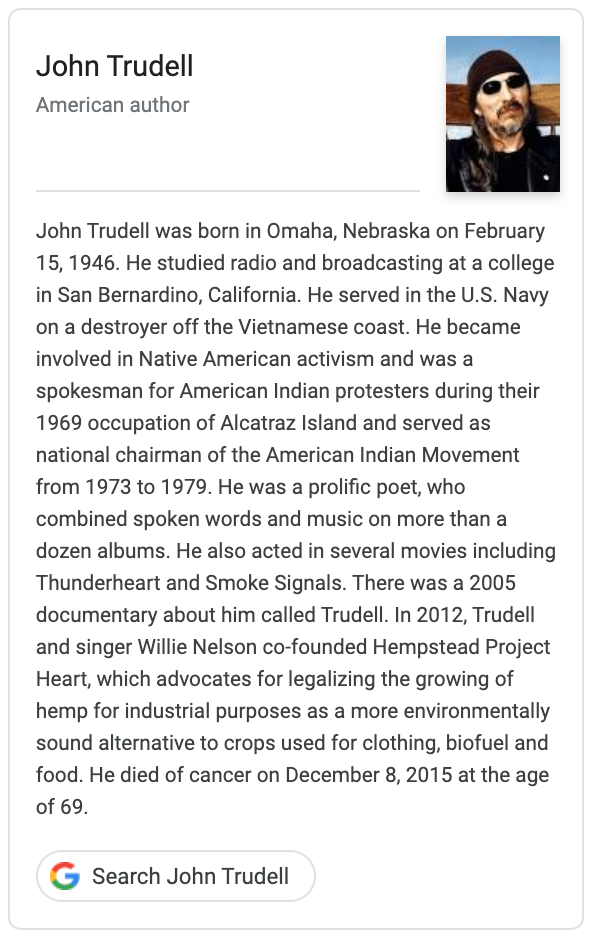

### Google books

John Trudell was born in Omaha, Nebraska on February 15, 1946. He
studied radio and broadcasting at a college in San Bernardino,
California. He served in the U.S. Navy on a destroyer off the
Vietnamese coast. He became involved in Native American activism and
was a spokesman for American Indian protesters during their 1969
occupation of Alcatraz Island and served as national chairman of the
American Indian Movement from 1973 to 1979. He was a prolific poet,
who combined spoken words and music on more than a dozen albums. He
also acted in several movies including Thunderheart and Smoke
Signals. There was a 2005 documentary about him called Trudell. In
2012, Trudell and singer Willie Nelson co-founded Hempstead Project
Heart, which advocates for legalizing the growing of hemp for
industrial purposes as a more environmentally sound alternative to
crops used for clothing, biofuel and food. He died of cancer on
December 8, 2015 at the age of 69.

* https://books.google.com/?q=john+trudell

### JohnTrudell.com

John Trudell has been identified as a poet, a fighter for Native
American rights, an agitator, and lots of other things.

* https://www.johntrudell.com/biography/
* http://web.archive.org/web/*/https://www.johntrudell.com/biography/

### Poetry Foundation

John Trudell    
1946–2015    
http://johntrudell.com

John Trudell was a Santee Dakota activist, performance artist, actor,
and poet, was born Omaha, Nebraska and he spent his early years living
on the Santee Reservation in northern Nebraska. He was an early member
of and spokesman for the Native American rights movement and helped to
promote a spoken word style that honors Native American oral
traditions. 

Trudell's life of activism began in 1969-70, when he was part of a
group of people who occupied Alcatraz Island, claiming that the newly
abandoned government property should revert back to the Indian
Nations. He became heavily involved in indigenous human rights efforts
in the 1970s, serving as chairman of the American Indian Movement
(AIM) from 1973 to 1979. Concerned with his activism, the FBI
developed a 17,000-page file on him. 

Trudell's poetry and performance developed simultanesously in the
1980s. He began setting his poetry to Native American music in 1982,
the year is first chapbook, Living in Reality, was published. The
following year, his debut album Tribal Voice appeared. His musical
work garnered him supporters such as Bob Dylan, Willie Nelson, Jackson
Browne, Bonnie Raitt, and John Fogerty. Many of Trudell's other 14
albums, including _AKA Graffiti Man_ (1986), _But This Isn’t El
Salavador_ (1987), and _Heart Jump Bouquet_ (1987), received critical
acclaim. His album _Bone Days_ (2001) was produced by Angelina
Jolie. His lyrics are collected in the book _Lines from a Mined Mind_
(2008, Fulcrum Press).
 
Trudell also began to appear in films, including _Thunderheart_
(1992), _On Deadly Ground_ (1994), _Extreme Measures_ (1996), and
_Smoke Signals_ (1998), and the documentary films _Incident at Oglala_
(1992) and _Trudell_ (2005).

He died in 2015.

* https://www.poetryfoundation.org/poets/john-trudell
* http://web.archive.org/web/*/https://www.poetryfoundation.org/poets/john-trudell

### Wikipedia

John Trudell was a Native American author, poet, actor, musician, and
political activist. He was the spokesperson for the United Indians of
All Tribes' takeover of Alcatraz beginning in 1969, broadcasting as
Radio Free Alcatraz.

* https://en.wikipedia.org/wiki/John_Trudell
* http://web.archive.org/web/*/https://en.wikipedia.org/wiki/John_Trudell

@siznax
