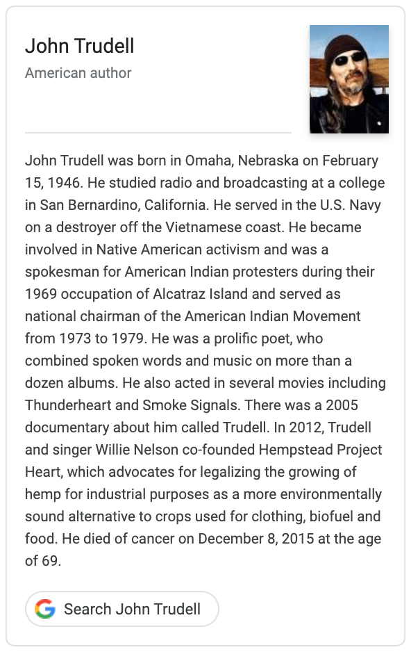

### Associated Press

LOS ANGELES (AP) — John Trudell, who was a spokesman for American
Indian protesters during their 1969 occupation of Alcatraz Island and
later headed the American Indian Movement, died Tuesday. He was 69.

* Obituary [obit-apnews.com.md](obit-apnews.com.md)
* Obituary https://apnews.com/6725b86e3382435ca02b0c3bb855c5fa/american-indian-activist-poet-john-trudell-dies-69
* Obituary http://web.archive.org/web/*/https://apnews.com/6725b86e3382435ca02b0c3bb855c5fa/american-indian-activist-poet-john-trudell-dies-69

### Google books

John Trudell was born in Omaha, Nebraska on February 15, 1946. He
studied radio and broadcasting at a college in San Bernardino,
California. He served in the U.S. Navy on a destroyer off the
Vietnamese coast. He became involved in Native American activism and
was a spokesman for American Indian protesters during their 1969
occupation of Alcatraz Island and served as national chairman of the
American Indian Movement from 1973 to 1979. He was a prolific poet,
who combined spoken words and music on more than a dozen albums. He
also acted in several movies including Thunderheart and Smoke
Signals. There was a 2005 documentary about him called Trudell. In
2012, Trudell and singer Willie Nelson co-founded Hempstead Project
Heart, which advocates for legalizing the growing of hemp for
industrial purposes as a more environmentally sound alternative to
crops used for clothing, biofuel and food. He died of cancer on
December 8, 2015 at the age of 69.

* Search https://books.google.com/?q=john+trudell

### JohnTrudell.com

John Trudell has been identified as a poet, a fighter for Native
American rights, an agitator, and lots of other things.

* Biography [bio-johntrudell.com.md](bio-johntrudell.com.md)
* Biography https://www.johntrudell.com/biography/
* Biography http://web.archive.org/web/*/https://www.johntrudell.com/biography/

See also: [bio-johntrudell.com-donate.md](bio-johntrudell.com-donate.md)

### The New York Times

John Trudell, whose outspokenness and charisma made him a leading
advocate of Native American rights, and who channeled his message of
righteous defiance into poetry and songwriting, died on Tuesday at his
home in Santa Clara County, Calif. He was 69.

* Biography [obit-nytimes.com.md](obit-nytimes.com.md)
* Biography https://www.nytimes.com/2015/12/10/us/john-trudell-outspoken-advocate-for-american-indians-is-dead-at-69.html
* Biography http://web.archive.org/web/*/https://www.nytimes.com/2015/12/10/us/john-trudell-outspoken-advocate-for-american-indians-is-dead-at-69.html

### The Pines

John Trudell was one of the leaders for the Indian of All Tribes
Occupation of Alcatraz in 1969, ran Radio Free Alcatraz, and went on
to serve as Chairman of the American Indian Movement (AIM) from
1973-1979. On February 11, 1979, he burned an American flag on the
steps of the F.B.I J. Edgar Hoover building in Washington D.C.,
explaining that he had been taught in the military to burn the flag
once it had been desecrated; and that the US government’s treatment of
Native Americans, and the country’s classism and racism had desecrated
the flag. About 12 hours after the flag incident, in the early morning
of Abraham Lincoln’s birthday, a fire “of suspicious origin” burned
down Trudell’s home on the Shoshone Palute reservation in Nevada,
killing Trudell’s pregnant wife, Tina, their three children and Tina’s
mother. The F.B.I. declined to investigate, and the blaze was
officially ruled an “accident.” 

He turned his tears into writing poetry and later, music and
acting. He released several volumes of poetry and appearing in such
films as Thunderheart and Smoke Signals. He also recorded several
highly regarded albums combining spoken word and music. A lifelong
activist and human rights advocate, he was quoted as saying “I’m just
a human being trying to make it in a world that is rapidly losing its
understanding of being human.”

* https://www.youtube.com/watch?v=fRTMe_EPgSM

### Poetry Foundation

John Trudell was a Santee Dakota activist, performance artist, actor,
and poet, was born Omaha, Nebraska and he spent his early years living
on the Santee Reservation in northern Nebraska. He was an early member
of and spokesman for the Native American rights movement and helped to
promote a spoken word style that honors Native American oral
traditions. 

* Biography [bio-poetryfoundation.org.md](bio-poetryfoundation.org.md)
* Biography https://www.poetryfoundation.org/poets/john-trudell
* Biography http://web.archive.org/web/*/https://www.poetryfoundation.org/poets/john-trudell

### Wikipedia

John Trudell was a Native American author, poet, actor, musician, and
political activist. He was the spokesperson for the United Indians of
All Tribes' takeover of Alcatraz beginning in 1969, broadcasting as
Radio Free Alcatraz.

* Wikipedia (Markdown of source TBD)
* Wikipedia https://en.wikipedia.org/wiki/John_Trudell
* Wikipedia http://web.archive.org/web/*/https://en.wikipedia.org/wiki/John_Trudell

@siznax
