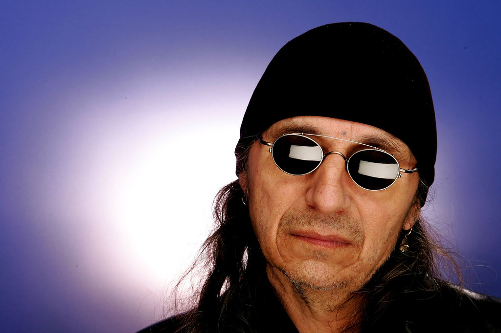

John Trudell, Outspoken Advocate for American Indians, Is Dead at 69
====================================================================

Bruce Weber

9 December 2015

The New York Times

https://www.nytimes.com/2015/12/10/us/john-trudell-outspoken-advocate-for-american-indians-is-dead-at-69.html

_John Trudell in 1971 near Richmond, Calif. In 1969, he joined an
occupation of Alcatraz Island that lasted for 19 months. Richard
Drew/Associated Press_

John Trudell, whose outspokenness and charisma made him a leading
advocate of Native American rights, and who channeled his message of
righteous defiance into poetry and songwriting, died on Tuesday at his
home in Santa Clara County, Calif. He was 69.

The cause was cancer, said Cree Miller, the trustee of Mr. Trudell's
estate.

Mr. Trudell, a Santee Dakota, was national chairman of the American
Indian Movement during much of the 1970s, a turbulent stretch in the
relationship between Native American activists and the federal
government.

His tenure began after the episode at Wounded Knee, S.D., where, in
February 1973, Oglala Lakota from the Pine Ridge reservation, incensed
by tribal corruption, and American Indian Movement activists,
protesting the government's treatment of their people, occupied the
town in a 71-day standoff with federal marshals and F.B.I. agents.

Three men -- Bob Robideau, Darelle Butler and Leonard Peltier -- were
tried in the killing of two agents during a confrontation in Oglala,
S.D., two years later.

Mr. Trudell -- "the most eloquent speaker in the Movement," as Peter
Matthiessen wrote in "In the Spirit of Crazy Horse," his 1983 book
about the siege -- held community meetings in Cedar Rapids, Iowa,
where the trial of Mr. Robideau and Mr. Butler was held, and he
testified for the defense. The two men were acquitted. Mr. Peltier,
tried later, was convicted and remains in prison.

But well before that, Mr. Trudell had already made a name for himself
as an effective champion of his people, decrying the indignities they
had suffered for more than a century at the hands of the American
government.

In November 1972, he was among the leaders of a group that occupied
the Bureau of Indian Affairs in Washington, demanding the enforcement
of historical treaties that granted Native Americans sovereignty over
their land.

Perhaps most famously, in 1969, he joined an occupation of Alcatraz
Island, home of the former prison in San Francisco Bay, arguing that
the terms of an old treaty gave American Indians the right to unused
federal land.

The occupiers, calling themselves Indians of All Tribes, held the
island for 19 months, demanding that they be given the right to
develop it as a cultural and education center. Mr. Trudell, then in
his 20s, emerged as the group's spokesman, frequently delivering a
broadcast called "Radio Free Alcatraz" and speaking at news
conferences.

Rejecting a government proposal that the island be turned into a park
with "maximum Indian qualities," Mr. Trudell said: "We will no longer
be museum pieces, tourist attractions and politicians'
playthings. There will be no park on this island because it changes
the whole meaning of what we are here for."

_Mr. Trudell in 2005. Carlo Allegri/Getty Images_

The F.B.I. compiled a substantial file on him.

In 1979, Mr. Trudell burned an American flag on the steps of the
F.B.I. building in Washington, saying that the flag had been
desecrated by the government's behavior toward American Indians and
other minorities, and that burning was the appropriate way to dispose
of a desecrated flag.

The next day, his home in Nevada burned to the ground. The fire killed
his pregnant wife, Tina Manning, who was also an activist, as well as
their three children and Ms. Manning's mother.

An investigation by the Bureau of Indian Affairs found that the fire
was an accident. But some viewed the inquiry as perfunctory, and its
findings were questioned by an investigator hired by Mr. Trudell, who
suspected the fire had been deliberately set.

"I don't want to say that the F.B.I. kills innocent kids and
children," Lindsey Manning, a cousin of Tina Manning, said in
"[Trudell,"](https://www.youtube.com/watch?v=ooZ8xz9AgpM) an acclaimed
2005 documentary film by Heather Rae. "I just don't want to say
that. But you never know. You never know."

The film asserted that the cause of the fire had never been
established.

John Francis Trudell was born in Omaha on Feb. 15, 1946, and grew up
partly there and partly on a reservation near the South Dakota
border. His father, Clifford Trudell, was a Santee Dakota; his mother,
the former Ricarda Almanza, was of Mexican-Indian descent. She died
when John was a boy.

Mr. Trudell dropped out of high school and served in the Navy during
the Vietnam War. Afterward, he moved to Southern California, where he
studied radio and communications at a community college before joining
the Indians of All Tribes group on Alcatraz.

Mr. Trudell began to distance himself from the American Indian
Movement after the fire at his house, and in the 1980s, he turned to
writing. He published several volumes of poetry, including "Stickman"
and "Lines From a Mined Mind," often writing in protest of corporate
power and government oppression. He also recorded [spoken-word
albums](http://www.nytimes.com/1995/02/19/books/pop-music-a-sioux-poet-whose-fiery-protests-now-come-packaged-in-jewel-boxes.html?pagewanted=all)
accompanied by traditional Native American music as well as
contemporary pop. His latest album, "Wazi's Dream," was released this
year.

The recordings earned him admirers in the music world, including Bob
Dylan, Jackson Browne and Kris Kristofferson.

Mr. Trudell also acted in feature films, including "Thunderheart"
(1992), with Sam Shepard and Val Kilmer, in which he played a
character drawn from a crucial figure in the events leading to Wounded
Knee; and "Smoke Signals" (1998), based on a collection of short
stories by Sherman Alexie.

Mr. Trudell's first marriage, to Fenicia Ordonez, ended in divorce. He
is survived by a brother, Roger, and several children and
grandchildren. Ms. Miller, his estate's trustee, declined to say
specifically where Mr. Trudell lived in Santa Clara County.

"If this is the land of the free," Mr. Trudell said during the
occupation of Alcatraz, summarizing the issue that would propel his
life and work from then on, "we want to know why we don't have the
respect and dignity that all free men are accorded by other free men."

                                
### Correction: Dec. 11, 2015

Because of an editing error, an obituary on Thursday about the Native
American activist John Trudell referred incorrectly to the trials of
his fellow activists Bob Robideau, Darelle Butler and Leonard
Peltier. They were tried in the killing of two F.B.I. agents during a
confrontation in Oglala, S.D., in 1975 — not during the occupation of
Wounded Knee, S.D., in 1973.

### Correction: Dec. 14, 2015

An obituary on Thursday about John Trudell, a leading advocate of
Native American rights, misstated the source material for the movie
“Smoke Signals” in which Mr. Trudell had a role. It was based on a
collection of short stories by Sherman Alexie, not on a novel by
Mr. Alexie.

_A version of this article appears in print on Dec. 10, 2015, Section
A, Page 31 of the New York edition with the headline: John Trudell,
Outspoken Advocate for American Indians, Is Dead at 69._

~
