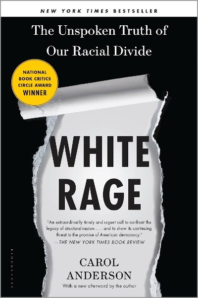
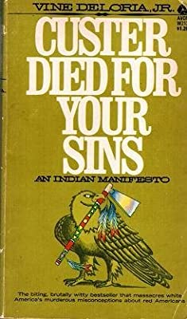

The Heartbeat of Wounded Knee
-----------------------------

By David Treuer

2019 · Riverhead Books · 528pp

_Native America From 1890 to the Present_

In The Heartbeat of Wounded Knee, Treuer melds history with
reportage and memoir. Tracing the tribes' distinctive cultures from
first contact, he explores how the depredations of each era spawned
new modes of survival. The devastating seizures of land gave rise to
increasingly sophisticated legal and political maneuvering that put
the lie to the myth that Indians don't know or care about
property. The forced assimilation of their children at
government-run boarding schools incubated a unifying Native
identity. Conscription in the US military and the pull of urban life
brought Indians into the mainstream and modern times, even as it
steered the emerging shape of self-rule and spawned a new generation
of resistance. The Heartbeat of Wounded Knee is the essential,
intimate story of a resilient people in a transformative era.

**David Treuer** is Ojibwe from the Leech Lake Reservation in northern
Minnesota. The author of four previous novels, most recently Prudence,
and two books of nonfiction, he has also written for The New York
Times, Los Angeles Times, Esquire, Slate, and The Washington Post,
among others. He has a Ph.D. in anthropology and teaches literature
and creative writing at the University of Southern California.

* Publisher https://www.penguinrandomhouse.com/books/316457/the-heartbeat-of-wounded-knee-by-david-treuer/
* Review https://www.startribune.com/review-the-heartbeat-of-wounded-knee-by-david-treuer/504504972/
* Review https://www.npr.org/2019/01/25/688499170/the-heartbeat-of-wounded-knee-aims-to-usher-in-a-new-narrative-for-native-americ
* Review https://www.nytimes.com/2019/01/20/books/review/david-treuer-heartbeat-wounded-knee.html
* Google Books https://www.google.com/books/edition/_/oG-DDwAAQBAJ?hl=en

The Overstory
-------------

By Richard Powers

2018 · Novel · W.W. Norton & Company · 512pp

_Pulitzer Prize for Fiction_

The Overstory is a novel by Richard Powers published in 2018 by
W.W. Norton. It is Powers's twelfth novel. The novel is about nine
Americans whose unique life experiences with trees bring them together
to address the destruction of forests.

* Author http://www.richardpowers.net/the-overstory/
* Wikipedia https://en.wikipedia.org/wiki/The_Overstory
* Review https://www.theguardian.com/books/2018/mar/23/the-overstory-by-richard-powers-review
* Review https://www.theatlantic.com/entertainment/archive/2019/04/richard-powers-pulitzer-the-overstory/587245/
* Interview https://www.pbs.org/newshour/show/the-overstory-author-richard-powers-answers-your-questions
* More https://www.pbs.org/newshour/arts/loved-the-overstory-richard-powers-recommends-26-other-books-on-trees

There, There
------------

by Tommy Orange

2018 · Novel/Political Fiction · Alfred A. Knopf · 304pp

There There is a wondrous and shattering portrait of an America few
of us have ever seen. It’s “masterful . . . white-hot
. . . devastating” (The Washington Post) at the same time as it is
fierce, funny, suspenseful, thoroughly modern, and impossible to put
down. Here is a voice we have never heard—a voice full of poetry and
rage, exploding onto the page with urgency and force. Tommy Orange
has written a stunning novel that grapples with a complex and
painful history, with an inheritance of beauty and profound
spirituality, and with a plague of addiction, abuse, and
suicide. This is the book that everyone is talking about right now,
and it’s destined to be a classic.

* Google Books https://www.google.com/books/edition/There_There/Dw83DwAAQBAJ

White Rage
----------

By Carol Anderson

2017 · Bloomsbury Publishing · 267pp

_The Unspoken Truth of Our Racial Divide_

White Rage: The Unspoken Truth of Our Racial Divide is a 2016
nonfiction book by Emory University professor Carol Anderson. She had
been contracted to write the book following reaction to an op-ed she
wrote for The Washington Post in 2014.

Carefully linking historical flashpoints when social progress for
African Americans was countered by deliberate and cleverly crafted
opposition, Anderson pulls back the veil that has long covered actions
made in the name of protecting democracy, fiscal responsibility, or
protection against fraud, rendering visible the long lineage of white
rage. Compelling and dramatic in the unimpeachable history it relates,
White Rage will add an important new dimension to the national
conversation about race in America.

* Author https://www.professorcarolanderson.org/white-rage
* Publisher https://www.bloomsbury.com/us/white-rage-9781632864123/

We Are Still Here
-----------------

By Peter Iverson, Wade Davies

2014 · History/Native Americans · Wiley · 368pp

_American Indians Since 1890_

In addition to revisions and updates, the second edition of “We Are
Still Here” features new material, seeing this well-loved American
History Series volume maintain its treatment of American Indians in
the 20th century while extending its coverage into the opening decades
of the 21st century.

Provides student and general readers concise and engaging coverage of
contemporary history of American Indians contributed by top scholars
and instructors in the field Represents an ideal supplement to any
U.S. or Native American survey text Includes a completely up-to-date
synthesis of the most current literature in the field Features a
comprehensive Bibliographical Essay that serves to aid student
research and writing Covers American Indian history from 1890 through
2013.

* Publisher https://www.wiley.com/en-us/%22%22We+Are+Still+Here%22%22%3A+American+Indians+Since+1890%2C+2nd+Edition-p-9781118751589

Everything You Wanted to Know about Indians But Were Afraid to Ask
------------------------------------------------------------------

By Anton Treuer

2012 · History/Native Americans · Minnesota Historical Society Press · 190pp

What have you always wanted to know about Indians? Do you think you
should already know the answers -- or suspect that your questions may
be offensive? In matter-of-fact responses to over 120 questions, both
thoughtful and outrageous, modern and historical, Ojibwe scholar and
cultural preservationist Anton Treuer gives a frank, funny, and
sometimes personal tour of what's up with Indians, anyway.

Anton Treuer is an American academic and author specializing in the
Ojibwe language and American Indian studies. He is professor of Ojibwe
at Bemidji State University, Minnesota and a 2008 Guggenheim Fellow.

* Publisher https://birchbarkbooks.com/all-online-titles/everything-you-wanted-to-know-about-indians-but-were-afraid-to-ask

Lines from a Mined Mind: The Words of John Trudell
--------------------------------------------------

By John Trudell

2008 · Poetry/Songs · Fulcrum Pub · 280pp

_A collection of 25 years of poetry, lyrics and essays._

**John Trudell** is an acclaimed poet, national recording artist,
actor, and activist whose international following reflects the
universal language of his words, work, and message. Trudell (Santee
Sioux) was a spokesperson for the Indian of All Tribes occupation of
Alcatraz Island from 1969 to 1971. He then worked with the American
Indian Movement, serving as chairman from 1973 to 1979.

* Publisher https://fulcrum.bookstore.ipgbook.com/lines-from-a-mined-mind-products-9781555916787.php

Kill the Indian, Save the Man
-----------------------------

by Ward Churchill

2004 · City Lights Books · 128pp

_The Genocidal Impact of American Indian Residential Schools_

For five consecutive generations, from roughly 1880 to 1980, Native
American children in the United States and Canada were forcibly taken
from their families and relocated to residential schools. The stated
goal of this government program was to "kill the Indian to save the
man." Half of the children did not survive the experience, and those
who did were left permanently scarred. The resulting alcoholism,
suicide, and the transmission of trauma to their own children has led
to a social disintegration with results that can only be described as
genocidal.

* Publisher http://www.citylights.com/book/?GCOI=87286100529180
* Wikipedia https://en.wikipedia.org/wiki/Kill_the_Indian,_Save_the_Man

Struggle for the Land
---------------------

By Ward Churchill

2002 · City Lights Books · 460pp

_Native North American Resistance to Genocide, Ecocide and Colonization_

Struggle for the Land: Native North American Resistance to Genocide,
Ecocide and Colonization is a book by Ward Churchill. It is a
collection of essays on the efforts of Native Americans in the United
States and in Canada to maintain their land tenure claims against
government and corporate infringement. Equating colonization with
genocide and ecocide, the author provides examples of resistance.

Beginning with an overview of the impact of legal doctrines
established by the United States and Canada on Native people, and
moving on to explore a series of case studies indicative of the
effects of domination "by North America's settler-states," the book
concludes with a discussion paper offering a scenario for an alternate
future.

* Publisher http://www.citylights.com/book/?GCOI=87286100700140
* Wikipedia https://en.wikipedia.org/wiki/Struggle_for_the_Land

Chronology of American Indian History: The Trail of the Wind
------------------------------------------------------------

by Liz Sonneborn

2001 · Facts On File · 442pp

A year-by-year chronicle of interesting and important moments in
Indian history, including major wars and battles, federal Indian
policies and reactions to them, legal rulings, individual
achievements, protests, migrations, religious movements, and other
topics. Each event mentioned is followed by a one to two paragraph
elaboration. Sidebar quotations throughout the volume offer insight
into people's thoughts and perceptions of important events described.

https://archive.org/details/chronologyofamer0000sonn

A Forest of Time: American Indian Ways of History
-------------------------------------------------

by Peter Nabokov

2002 · Cambridge University Press · 246pp

A study of the many different ways Native American groups have defined
their histories for their own purposes. Includes bibliographical
references and index.

Some dynamics of American Indian historicity -- Within reach of
memory: oral traditions, legends, and history -- Almost timeless
truths: myth and history -- Commentaries and subversions: memorates,
jokes, tales, and history -- Anchoring the past in place: geography
and history -- Memories in things: material culture and Indian
histories -- Renewing, remembering, and resisting: rituals and history
-- Old stories, new ways: writing, power, and Indian histories --
Futures of Indian pasts: prophecy and history

* Internet Archive https://archive.org/details/forestoftimeamer0000nabo

Stickman: Poems, Lyrics, Talks
------------------------------

by John Trudell
Edited by Paola Igliori

1994 · New York: Inanout Press · 168pp

John Trudell became involved in Native American activism and was a
spokesman for American Indian protesters during their 1969 occupation
of Alcatraz Island and served as national chairman of the American
Indian Movement from 1973 to 1979. He was a prolific poet, who
combined spoken words and music on more than a dozen albums. He also
acted in several movies including Thunderheart and Smoke
Signals. There was a 2005 documentary about him called Trudell. In
2012, Trudell and singer Willie Nelson co-founded Hempstead Project
Heart, which advocates for legalizing the growing of hemp for
industrial purposes as a more environmentally sound alternative to
crops used for clothing, biofuel and food. He died of cancer on
December 8, 2015 at the age of 69.

Mankiller: A Chief and Her People
---------------------------------

1993 · History · St. Martin's Press · 356pp

The story of the Cherokee Nation is told by Wilma Mankiller, who
recounts her life and the racism she faced in her fight to lead
it. Wilma Mankiller has been the principal chief of the Cherokee
Nation since 1985. She tells her personal story (her political
awakening came during the 1970 occupation of Alcatraz island),
interwoven with the complex history of the Cherokee Nation.

* Wikipedia https://en.wikipedia.org/wiki/Wilma_Mankiller
* Worldcat http://www.worldcat.org/oclc/780144464

500 Years of Indigenous Resistance
----------------------------------

1992 by Anonymous, The Anarchist Library

2002 by Gord Hill

An alternative and unorthodox view of the colonization of the Americas
by Europeans is offered in this concise history. Eurocentric studies
of the conquest of the Americas present colonization as a civilizing
force for good, and the native populations as primitive or
worse. Colonization is seen as a mutually beneficial process, in which
"civilization” was brought to the natives who in return shared their
land and cultures. The opposing historical camp views colonization as
a form of genocide in which the native populations were passive
victims overwhelmed by European military power. In this fresh
examination, an activist and historian of native descent argues that
the colonial powers met resistance from the indigenous inhabitants and
that these confrontations shaped the forms and extent of
colonialism. This account encompasses North and South America, the
development of nation-states, and the resurgence of indigenous
resistance in the post-World War II era.

* https://archive.org/details/al_Anonymous_500_Years_of_Indigenous_Resistance_a4
* https://archive.org/details/GordHill500YearsOfIndigenousResistance/

Living in Reality: Songs Called Poems
-------------------------------------

by John Trudell

1982 · Society of the People Struggling to be Free · 71pp

Water for Life Poettree Publishings, Society of the People Struggling
to be Free, 1982. Jan Attridge, illustrator. Most likely a later
edition, printed by Common Weath Printing. Near Fine in wrappers.

The first book by this Sioux poet/activist, who was a founder and
National Chairman of the radical American Indian Movement during the
1970s; a turbulent time of Native American political activism. Trudell
became the spokesman for the Indians of All Tribes who occupied
Alcatraz Island, which led to the founding of AIM. He was the Chair of
AIM during the Wounded Knee siege and the Pine Ridge battle that left
two FBI agents and one Indian youth dead and resulted in Leonard
Peltier's conviction and incarceration for murder. Trudell's own
family, his wife and three children, were killed in a fire set by an
arsonist, which Trudell has long considered to have been an attempt to
strike back at him for his radical activism and militancy, including
his advocacy of the use of violence in pursuing claims of Native
rights. He appeared in the documentary film about Peltier, Incident at
Oglala, and was later cast as a charismatic Indian leader in the
fictionalized film version of that story, Thunderheart. He is a
musician as well as a poet and is also known as an eloquent speaker,
both as a political leader and, more recently, as a guest lecturer.

The Ohlone Way
--------------

by Malcolm Margolin

1978 · Heyday Books · 182pp

_Indian Life in the San Francisco-Monterey Bay Area_

Two hundred years ago, herds of elk and antelope dotted the hills of
the San Francisco-Monterey Bay area. Grizzly bears lumbered down to
the creeks to fish for silver salmon and steelhead trout. From vast
marshlands geese, ducks, and other birds rose in thick clouds "with
a sound like that of a hurricane." This land of "inexpressible
fertility," as one early explorer described it, supported one of the
densest Indian populations in all of North America.

* Publisher https://heydaybooks.com/the-ohlone-way/
* Google https://www.google.com/books/edition/The_Ohlone_Way/vapzCy2oVQoC

Custer Died for Your Sins; an Indian Manifesto
----------------------------------------------

Vine Deloria Jr.
1969
Macmillan

Custer Died for Your Sins: An Indian Manifesto, is a 1969, non-fiction
book by the lawyer, professor and writer Vine Deloria, Jr. The book
was noteworthy for its relevance to the Alcatraz-Red Power Movement
and other activist organizations, such as the American Indian
Movement, which was beginning to expand.

Fifty-years years ago Vine Deloria, Jr., an enrolled citizen of the
Standing Rock Lakota Nation, published Custer Died for Your Sins: An
Indian Manifesto. For 1969 mainstream America the title was an
attention-grabbing, blasphemous play on the well-known and oft-used
Jesus-died-for-your-sins. Deloria took the phrase from a bumper
sticker of the same name that he had helped create and said it
referred to the bad faith the U.S. demonstrated in failing to fulfill
the provisions of the Sioux Treaty of 1868. He explained, “Under the
covenants of the Old Testament, breaking a covenant called for a blood
sacrifice for atonement. Custer was the blood sacrifice for the United
States breaking the Sioux treaty.”

The title was an apt label for a work that excoriated the actions,
white-washed history, and on-going racism of the times. Unfortunately,
fifty years on, while some of the references and observations are
clearly dated, the basic hard truths and embedded injustices continue
to underpin today’s Native reality.

* Internet Archive https://archive.org/details/custerdiedfory00delo
* Internet Archive https://archive.org/details/custerdiedforyou00delo
* Publisher https://www.oupress.com/books/9779813/custer-died-for-your-sins
* Review https://indiancountrytoday.com/opinion/custer-died-for-your-sins-tributes-from-indian-country-iyVOj-Z-IUKpfjjcb0OufA
* Wikipedia https://en.wikipedia.org/wiki/Custer_Died_for_Your_Sins
* YouTube https://www.youtube.com/watch?v=ClCLKps97G0

See also:

* Vine Deloria 
  https://en.wikipedia.org/wiki/Vine_Deloria_Jr.  
* Vine Deloria on Native Americans (1972)
  https://www.youtube.com/watch?v=JmFW0aXwSoM
* Vine Deloria on Technology (2001)
  https://www.youtube.com/watch?v=x-XGnk4VbeA
* Vine Deloria's last interview
  https://www.youtube.com/watch?v=YLI4srZuh5A

The Long Death: The Last Days of the Plains Indians
---------------------------------------------------

by Ralph K. Andrist    

1969 · Collier Books · 420pp

"A vividly, swiftly paced account of the Plains Indian Wars, and the
disposession of the Plains Indians in the half century after 1840"
—The New York Times Book Review

https://archive.org/details/longdeath00ralp

House Made of Dawn
------------------

by N. Scott Mamaday

1968 · Novel/Historical Fiction · 

_Pulitzer Prize for Fiction_

House Made of Dawn is a 1968 novel by N. Scott Momaday, widely
credited as leading the way for the breakthrough of Native American
literature into the mainstream. It was awarded the Pulitzer Prize for
Fiction in 1969, and has also been noted for its significance in
Native American anthropology.

@siznax
