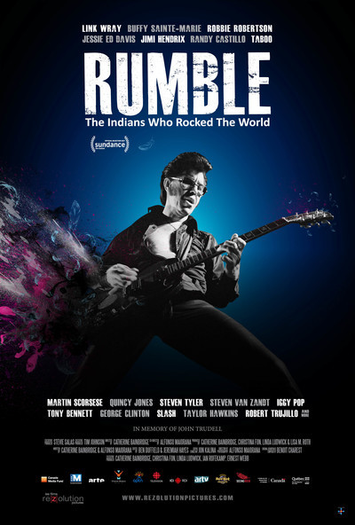
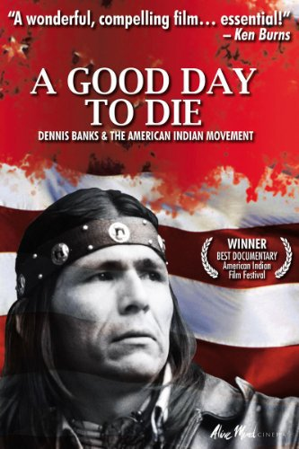
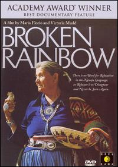

# "The energy corporations want the natural resources _under_ Indian land, and if necessary, the native people will be sacrificed" —_Broken Rainbow_

### Rumble: The Indians Who Rocked the World

2017 ‧ Documentary/Music ‧ 1h 43m

Filmmaker Catherine Bainbridge examines the role of Native Americans
in contemporary music history. She exposes a critical missing chapter,
revealing how indigenous musicians helped influence popular culture.

* Trailer https://www.youtube.com/watch?v=qDEtj-zjFzE
* IMDb

### Trudell

2005 · Documentary/American Indians · 1h 20m · [PG]

A chronicle of legendary Native American poet/activist John Trudell's
travels, spoken word performances and politics.

The film traces poet John Trudell's (1946-2015) life from his
childhood in Omaha, Nebraska, through his role as one of leaders of
the Occupation of Alcatraz and Radio Free Alcatraz in 1969, to serving
as Chairman of the American Indian Movement from 1973-1979. It also
covers his rebirth as a poet after his wife died in a house fire
suspected as arson.

* Trailer https://www.youtube.com/watch?v=y5Lf2LmxoFw
* IMDb https://www.imdb.com/title/tt0395796/

### Dark Blood

2012 · Thriller · 1h 26m

A widower living in the desert waits for the end of the world. When a
wealthy married couple arrives seeking shelter, the widower becomes
obsessed with the wife.

A young widower (River Phoenix) retreats to a remote nuclear testing
site to await the apocalypse, but finds his solitude disrupted by a
high-powered Hollywood couple (Jonathan Pryce and Judy Davis) whose
car broke down during a drive through the desert. Initially coming to
the couple's aid, the isolated man soon decides to imprison
them. Though director George Sluizer (The Vanishing) originally ceased
production of Dark Blood when the film's young star Phoenix died
tragically at 23, the film arrived onscreen nearly 20 years after its
original scheduled release date.

* Trailer https://www.youtube.com/watch?v=6OHjl4KTspw
* IMDb https://www.imdb.com/title/tt0293069

### A Good Day To Die

2011 · David Mueller, Lynn Salt · 1h 33m

A GOOD DAY TO DIE chronicles a movement that started a revolution and
inspired a nation. By recounting the life story of Dennis Banks, the
Native American who co-founded the American Indian Movement (AIM) in
1968 to advocate and protect the rights of American Indians, the film
provides an in-depth look at the history and issues surrounding AIM's
formation. From the forced assimilation of Native Americans within
boarding schools, to discrimination by law enforcement authorities, to
neglect by government officials responsible for the Bureau of Indian
Affairs, AIM sought redress for the many grievances that its people
harbored.

Banks' personal struggle culminated in major armed confrontations at
Custer, South Dakota and Wounded Knee -- climactic flash points which
saw him standing steadfast as a leader for his cause.

Bittersweet and compelling, A GOOD DAY TO DIE charts the rise and fall
of a movement that fought for the civil rights of American Indians.

* https://sfpl.kanopy.com/video/good-day-die

### Smoke Signals

1998 · Independent/Drama · 1h 29m · PG-13

Arnold (Gary Farmer) rescued Thomas (Evan Adams) from a fire when he
was a child. Thomas thinks of Arnold as a hero, while Arnold's son
Victor (Adam Beach) resents his father's alcoholism, violence and
abandonment of his family. Uneasy rivals and friends, Thomas and
Victor spend their days killing time on a Coeur d'Alene reservation in
Idaho and arguing about their cultural identities. When Arnold dies,
the duo set out on a cross-country journey to Phoenix to retrieve
Arnold's ashes.

* Trailer https://www.youtube.com/watch?v=DcXDGHLh5qA
* IMDb https://www.imdb.com/title/tt0120321/

### Thunderheart

1992 · Mystery/Western · 1h 59m · R

When a series of murders stuns a small Native American reservation,
the FBI sends in agent Ray Levoi (Val Kilmer) to investigate. While
Ray is relatively inexperienced, he is one quarter Sioux, and the FBI
hopes that will make it easier for them to gather information from the
locals. While the reservation police officer (Graham Greene) views the
agent as an outsider, the tribal elder (Chief Ted Thin Elk) believes
him to be the reincarnated spirit of Thunderheart, a Native American
hero.

* IMDb https://www.imdb.com/title/tt0105585/
* Trailer https://www.youtube.com/watch?v=8_zcWELlRg8
* Wikipedia https://en.wikipedia.org/wiki/Thunderheart

### Incident at Oglala: The Leonard Peltier Story

1992 ‧ Documentary/Political Drama ‧ 1h 30m · PG

Robert Redford narrates this documentary about the Pine Ridge Shootout
on an Oglala Sioux reservation in South Dakota. On June 26, 1975, two
FBI agents are searching for tribesman Leonard Peltier, wanted in
connection with an assault. They are killed after coming under heavy
fire, presumably from Peltier and his accomplices. However, proponents
claim that the FBI botched the investigation by tampering with and
suppressing evidence, and that Peltier's imprisonment is a miscarriage
of justice.

Michael Apted's documentary examines the 1975 slaying of two FBI
agents in Oglala, SD, which resulted in the arrest and conviction of
Native American activist Leonard Peltier for the murders. Making a
case for a retrial, Apted chronicles the tensions extant between the
U.S. government and the Oglala people since their occupation of
Wounded Knee in 1973 and examines the questionable circumstances
surrounding the investigation and subsequent trial of Peltier. The
film is a companion to Apted's own Thunderheart, which offers a
fictionalized account of the same case.

* IMDb https://www.imdb.com/title/tt0104504/
* Stream https://www.facebook.com/LeonardPeltierUSA/videos/incident-at-oglala/220627718494333/
* Trailer https://www.youtube.com/watch?v=oNmnpmQZ7Yo
* Wikipedia https://en.wikipedia.org/wiki/Incident_at_Oglala

See also: [Incident at
Oglala](https://www.zinnedproject.org/materials/incident-at-oglala/)
at Zinn Education Project

### Broken Rainbow

1985 ‧ Documentary/History/Native Americans ‧ 1h 10m

In 1983, President Ronald Reagan's controversial Secretary of the
Interior James Watt sold coal leases on federal land in New Mexico and
Arizona to developers for exploration and mining. Thousands of members
of the Navajo tribe lived on this land, part of their ancestral
homeland, and were forcibly relocated away from their homes. This
documentary examines this and other injustices in the U.S./Navajo
relationship. Narrated by actor Martin Sheen, the film won a Best
Documentary Feature Oscar.

https://www.youtube.com/watch?v=W5z8OgMfXXc

1. In 1985 on the Navajo reservation alone lie (00:07:15):
    * 100 million barrels of oil
    * 25 trillion cubic feet of gas
    * 80 billion pounds of uranium
    * 50 billion tons of coal
1. "The energy corporations want the natural resources _under_ Indian
   land, and if necessary, the native people will be sacrificed"
   (00:07:29)
1. For 150,000 moons Indian prayers have bonded the earth and sky. The
   _Anasazi_, stargazers and architects of antiquity, designed the 
   blueprint for North America. The Hopi, descendants of the Anasazi,
   are the oldest living culture today. The word "hopi" means peace,
   and the Hopi have been people of peace for thousands of years. The
   Hopis are a pueblo people that lie at the center of "this disputed
   area", farmed plots close to the pueblo.
1. The _Hopi_ have **synchronized their energies to the rhythms of
   the universe**. "Seeing the world in Hopi eyes is seeing the world
   in balance." (00:10:20)
1. A thousand years ago, the _Navajo_ (or Diné), migrated into the
   southwest. According to their mythology, they came into existance
   through a circular hole called the "emergence place". They settled
   within the four sacred mountains with the Hopi at the
   center. (00:11:00)
1. The Navajo and Hopi believe they were put here to be caretakers of
   mother earth, and to protect the sacred center of the universe. The
   Navajo became **shepards** and believed the sheep are gifts from
   holy people. With the wool, they learned to **weave** rugs which
   became their primary source of income in the modern world.
1. The Navajo learned how to farm the desert from the Hopi, and
   **corn** became a part of their lives. With farming, the people
   became rooted and built permanent structures called **hogans**
   which open to the east, to greet the sun.
1. **Big Mountain, Arizona** is a shrine to the Navajo who built their
   homes around its base. For generations, land was handed down from
   **mother to daughter**. In 1985, **half the people were ordered to
   relocate** (00:14:00)
1. The Navajo elders know the properties of different **plants and
   herbs**, how to prepare them for different purposes, how to use
   **crystals and prayers** for healing, how to use **planets and
   stars** in planting. The elders don't care about money. They don't
   use new materials for houses and clothes because they know they
   won't last long.
1. "Washington" does not recognize these ways, he would think these
   things have no value but they are sacred to us. "Washington" says
   go walk among people and places you don't know. **"We are not hard
   enough to survive in places that are unfamiliar to us. We will
   grieve for our homeland, and it'll kill us."** (00:17:45)
1. "If they lose this, then they lose the thing that is the most
   precious to them, which we might call our soul." —**Jerry Kammer** 
   Journalist and Author. Kammer also points out that **they believe
   that if they leave their ancestral homeland, then they die in a
   way, and they can never return**. It kills them in a very real way
   to them.
1. "I don't know who these white people are. I hear they come from
   some place across the water and now they're telling everyone what
   to do." (00:18:41)
1. Colonel **Kit Carson** burned Navajo crops, slaughtered Navajo
   livestock, and murdered innocent people. (00:19:50)
1. **The Long Walk** and The Place of Suffering, Forced migration from
   Fort Defiance in eastern New Mexico to Fort Sumner in Arizona where
   they were interned, neglected and exposed to death.
   https://en.wikipedia.org/wiki/Long_Walk_of_the_Navajo
1. 1/3 of the nation's strippable coal and 1/2 of its uranium is on
   Indian land.
1. A mormon lawyer named **John S. Boyden** wanted to strip mine the
   Hopi land. He held fraudulent elections in the Hopi villages and
   persuaded the BIA to appoint him attorney to the Hopi Tribal
   Council. The traditional Hopi lost control over their land and
   life.
1. **Peabody Coal** Col. Black Mesa Mine stripped 12 million a year
   from the Arizona plateau called Black Mesa. Black Mesa is a holy
   shrine to both Hopi and Navajo. Stripping her of her coal is as
   sacriligious as bulldozing St. Peter's Basilica for its
   marble. (00:36:10)
   https://en.wikipedia.org/wiki/Black_Mesa_Peabody_Coal_controversy
1. "300 Navajo families lost their homes and grazing lands when the
   [Peabody Coal] mine came in. They were neither consulted nor
   compensated. The pure air that once carried indian prayers to the
   heavens is now dense with lead, mercury dioxides, and sulphuric
   acids. Vast networks of power lines criss-cross their land. The
   indians call the transmission towers, White Man's Gods. **75% of
   the Navajo have no electricity themselves.** Vast quantities of
   water are used in the process of converting coal to electricity.
1. Interpreter for Traditinal Hopi Leaders, Thomas Canyacya says, we
   are facing a dangerous period ahead. If we do not stop, change, and
   correct some of these wrongdoings now, we are all going to
   suffer. Either things that we make will overtake us, or nature will
   take over; earthquake, flood, rain, severe drought, sever winter,
   lighting destruction, great wind destruction. These things will
   warn us that we are not following the law of The Great Spirit.
1. The U.S. Dept. of Interior disregarded the pleas of the elders, and
   urged tribal council memberss to sign leases that were
   substantially below market value: 0.4% of the value of their coal,
   1.3% of the value of their oil, 3.7% of the value of their uranium,
   and 1.8% of the value of their gas. (00:39:30)
1. 

### John Trudell's Hollywood Career (1989-2012)

Trudell created a career as an actor, performing in roles in "Pow
Wow Highway" (1989), Thunderheart (1992), On Deadly Ground (1994)
and Smoke Signals (1998) (as the Radio speaker Randy Peone on K-REZ
radio[23]). He was an adviser to the production of Incident at
Oglala, directed by Michael Apted and produced by Robert Redford. A
kind of companion piece to the fictional Thunderheart, the 1992
documentary explores facts related to the 1975 shooting of two FBI
agents at the Pine Ridge Indian Reservation, for which Leonard
Peltier was convicted in 1977. In Thunderheart, Trudell played a
character who resembles Peltier.

Dreamkeeper (2003) "The Legends of American Nations Come to Life"
features several traditional native stories. Trudell played a
character named Coyote in a story about A Spider and Coyote.

_Hollywood_ Filmography

* 1989 _Pow Wow Highway_ as Louie Short Hair 
* 1992 _Thunderheart_ as Jimmy Looks Twice 
* 1994 _On Deadly Ground_ as Johnny Redfeather 
* 1996 _Extreme Measures_ as Tony 
* 1998 _Smoke Signals_ as Randy Peone 
* 2004 _Sawtooth_ as Worm 
* 2012 _Dark Blood_ as Indian #2 (final film role)

https://en.wikipedia.org/wiki/John_Trudell#Film_career:

See also:

* [John Trudell](https://www.imdb.com/name/nm0874067/) on IMDb

### Annie Mae Brave-Hearted Woman

A film by Lan Brookes Ritz

1979 · Documentary/Native · 1h 23m

Testimony of 1970's American Indian Movement activists, including
Leonard Peltier, John Trudell, Leonard Crow Dog & Mary Crow Dog,
regarding AIM activism & US deep-state manipulation of Annie Mae & AIM
using deep-state agent-provocateur Douglas Durham & other cointelpro
tactics.

https://www.youtube.com/watch?v=TkAtJRf08xU

### American Indian Movement _Documentary 1970s_

Presented via YouTube by
[aimmovementmedia](https://www.youtube.com/channel/UCK7AP8Z_lCvKs0l3-9YImaQ)

A part of the A.I.M. Media Project, bringing the American Indian
Movement audio and video archives to the public.

https://www.youtube.com/watch?v=7CoypTJgG74

----

### Rising Voices: Hótȟaŋiŋpi - Revitalizing the Lakota Language

2006 ‧ Documentary ‧ 1h 55m

The 1838 Cherokee removal from the southeastern United States is
chronicled.

Narrated by James Earl Jones, "Trail of Tears: Cherokee Legacy"
explores one of the great historical tragedies of America's aboriginal
people. In 1830, eager to gain access to lands inhabited by Native
Americans, President Andrew Jackson enacted the Indian Removal Act
which forced the Cherokee Nation to leave their homeland and relocate
into unchartered territory. Many of these forced settlers suffered
from exposure, disease and starvation during the relocation. Nearly
one quarter of the Cherokee Nation died along the way. 

**Part I** (60m)

<https://vimeopro.com/octapixx/foxtel-3/video/54811286>

**Part II** (60m)

<https://vimeopro.com/octapixx/foxtel-3/video/54812274>

### The Return of Navajo Boy

2000 ‧ Documentary/History/Native Americans ‧ 52 mins

The Return of Navajo Boy is a documentary film produced by Jeff Spitz
and Bennie Klain about the Cly family, Navajo who live on their
reservation.

https://navajoboy.com/watch/

----

### Rising Voices: Hótȟaŋiŋpi

_Revitalizing the Lakota Language_

2018 · The Language Conservancy · 57m

Rising voices/Hótȟaŋiŋpi from The Language Conservancy and Florentine
Films profiles Lakota language loss and revitalization.

* stream https://www.youtube.com/watch?v=Wr-jackHWCw
* https://risingvoicesfilm.com/the-project/

### Tasunke Witko (Crazy Horse): A Documentary Film

2012 · Documentary · ...

Told from the perspective of contemporary Lakota people, the film
explores the life of Crazy Horse (Tasunke Witko). Viewers see the
natural world of the Dakotas, Nebraska, Wyoming, and Montana that
Crazy Horse knew. His spiritual nature is discussed, as are his unique
qualities as a leader. The final portion of the film examines his role
at the Battle of Little Bighorn, his resistance against reservation
life, and his violent death at Fort Robinson in 1877. Lakota people
share what Crazy Horse means in their world today. The film features
original music created for this story. Sharing their insights are
Lakota historians Jace DeCory, Donovin Sprague, Wilmer Mesteth and
Whitney Recountre.

See also

* https://www.wolakotaproject.org/tasunke-witko/

### Warrior: The Life of Leonard Peltier

1991 · Documentary/Crime · 1h 25m

An intimate exploration of the circumstances surrounding the
incarceration of Native American activist Leonard Peltier, convicted
of murder, with commentary from those involved, including Peltier
himself.

https://www.facebook.com/LeonardPeltierUSA/videos/warrior-the-life-of-leonard-peltier/220636778493427/

@siznax
